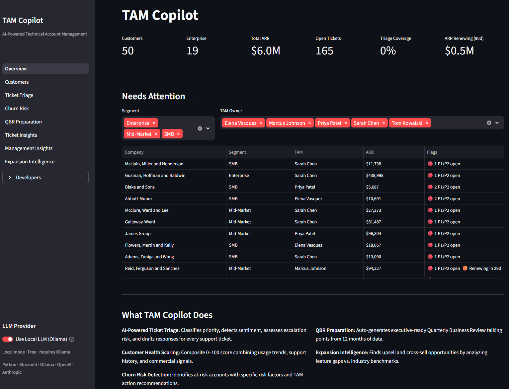

# TAM Copilot

AI-powered Technical Account Management dashboard built to demonstrate LLM engineering, structured outputs, cost-aware provider routing, and deep TAM/CSM domain knowledge.

**[Try the live demo →](https://tam-copilot.streamlit.app)**

> **Note:** Hosted on Streamlit's free tier — the app sleeps after a period of inactivity. If you see a "This app has gone to sleep" screen, click the wake-up button and allow 30–60 seconds to start.



---

## Why I built this

The TAM role is reactive by default — triage, health monitoring, QBR prep, and churn assessment each live in a different tool, and the work of connecting them falls to manual effort or doesn't happen at all. This app models what the proactive version looks like when the data is unified: see at a glance which accounts need attention today, run triage across an entire portfolio without opening each ticket individually, identify churn risk before renewal pressure hits, and generate QBR material from twelve months of structured data rather than from memory.

This is a portfolio project targeting Solutions Architect and pre-sales engineering roles. It's built to demonstrate both domain fluency — the pages and workflows reflect what someone who has actually done TAM work would want to see — and technical depth: provider abstraction, structured outputs, quality-aware routing, and an eval framework with a labeled dataset.

Fixture data covers 50 customers, 500 tickets, usage records, and subscriptions — all committed to the repo so any reviewer can clone and run immediately.

---

## Features

| Page | What it does |
|---|---|
| **Overview** | Morning briefing — portfolio stats, accounts needing attention (P1/P2 open, renewals, low utilization), ARR at renewal |
| **Customers** | Full portfolio table with risk flags; click any account for a detail view: usage trend chart, features adopted, open tickets, AI health score |
| **Ticket Triage** | Single-ticket AI triage: priority, sentiment, escalation risk, suggested response, accept/edit flows; batch triage scoped by customer, TAM, or full portfolio with one-click save |
| **Churn Risk** | Heuristic pre-ranking of at-risk accounts; per-account AI assessment with churn probability, risk factors, recommended actions, and outreach draft |
| **QBR Prep** | Generates executive-ready QBR talking points from 12 months of data — business wins, open risks, strategic asks, suggested agenda; downloadable as text |
| **Ticket Insights** | Tag frequency, volume by priority/category, trend over time, on-demand AI narrative, and full-text ticket search |
| **Management Insights** | TAM-level triage coverage, segment comparison matrix, tag heatmap (segment × tag), AI executive summary |
| **Expansion Intelligence** | Heuristic expansion score ranking (seat utilization, DAU/MAU, peer feature gaps); per-account AI opportunities with ARR uplift estimates and suggested pitches |

Developer tools (collapsible sidebar section):

| Page | What it does |
|---|---|
| **Eval Dashboard** | Run labeled evals for Ticket Triage, QBR Prep, or Churn Risk against any provider; side-by-side accuracy/latency/cost comparison |
| **Technical Info** | Live Ollama status, active provider config, env var reference, quality routing rules, fixture stats, stack versions |

---

## Architecture

```
LLM Router → Ollama (local, free)           ← development / cost-free demo
           → GPT-5.4-nano (OpenAI API)      ← production default (~$0.001/call)
           → Claude Haiku 4.5 (Anthropic)   ← quality tasks: P1 triage, QBR, insights
```

Provider selection is a single `.env` flag — no code changes needed to switch. Quality-sensitive tasks (`quality_required=True`) automatically upgrade to Claude when an Anthropic key is available, otherwise fall back to GPT-5.4-nano.

**Quality routing triggers:** P1 ticket triage, churn risk within 90 days of renewal, QBR generation, AI narrative summaries (tag insights, management insights).

---

## Stack

Python · Streamlit · Pydantic v2 · OpenAI GPT-5.4-nano · Anthropic Claude Haiku 4.5 · Ollama · Faker

---

## Setup

```bash
git clone https://github.com/alexjustdoit/tam-copilot
cd tam-copilot
python3 -m venv venv && source venv/bin/activate
pip install -r requirements.txt
cp .env.example .env        # edit: set USE_LOCAL_LLM and API keys
streamlit run app/streamlit_app.py
```

**Windows:** replace `cp` with `copy` and `source venv/bin/activate` with `venv\Scripts\activate`.

Fixture data (50 customers, 500 tickets, usage records, subscriptions) is committed — the app runs immediately with no seed step.

**Environment variables** (in `.env`):

```bash
USE_LOCAL_LLM=true          # true → Ollama (free); false → OpenAI/Claude API
OPENAI_API_KEY=sk-...       # required when USE_LOCAL_LLM=false
ANTHROPIC_API_KEY=sk-ant-...  # optional — enables quality routing to Claude
```

To run fully free locally, install [Ollama](https://ollama.com), run `ollama pull llama3.1:8b`, and set `USE_LOCAL_LLM=true`. All LLM calls run on your machine at no cost. Demo session cost on API providers: ~$0.05–0.20 total.

---

## Tests

```bash
pytest tests/ -v
```

28 tests covering data generators, LLM router, feature module schemas, provider wiring, tag insights, and taxonomy persistence.

## Eval

```bash
python eval/evaluator.py --providers openai,claude
python eval/evaluator.py --providers local   # requires Ollama
```

Labeled evaluation datasets for three features:
- **Ticket Triage** — 20 cases covering priority, sentiment, escalation risk, category accuracy
- **QBR Prep** — 3 cases with realistic customer scenarios; scored on output structure, field presence, word-count compliance
- **Churn Risk** — 3 cases with declining/stable/growth usage; scored on risk tier validity and probability ranges

Run evals from the CLI above or via the **Eval Dashboard** page. Select a feature, choose providers, and click Run Eval to see accuracy, latency, and cost trade-offs. Results are saved to `eval/results.json`.

## Project Structure

```
tam-copilot/
├── app/
│   ├── streamlit_app.py        # entry point, navigation, Overview page
│   ├── components/sidebar.py   # shared sidebar (header + footer)
│   └── pages/                  # 8 main pages + 2 developer pages
├── features/                   # ticket_triage, health_score, churn_risk,
│                               # qbr_prep, expansion, tag_insights
├── llm/
│   ├── router.py               # USE_LOCAL_LLM routing + quality_required logic
│   └── providers/              # OllamaProvider, OpenAIProvider, ClaudeProvider
├── data/
│   ├── models.py               # Pydantic models (Customer, Ticket, Usage, Subscription)
│   ├── generators/             # Faker-based fixture generators
│   ├── fixtures/               # committed JSON — app works on fresh clone
│   ├── taxonomy.json           # tag/category vocabulary, grows as TAMs triage
│   └── taxonomy.py             # load/save helpers
├── eval/
│   ├── evaluator.py            # CLI eval runner
│   ├── metrics.py              # scoring logic (EvalReport, score_triage)
│   └── datasets/               # 20-case labeled JSONL dataset
└── tests/                      # pytest suite
```
